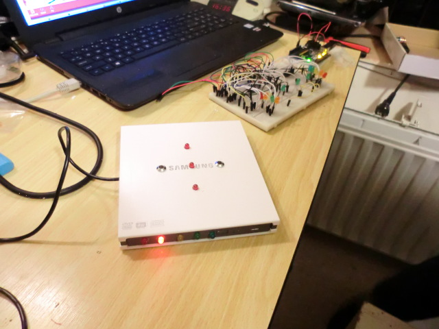
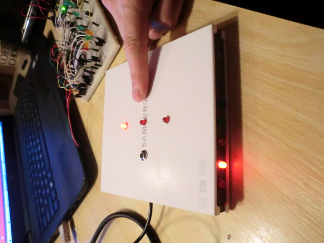
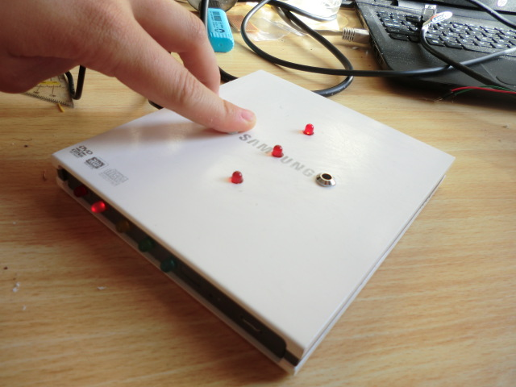
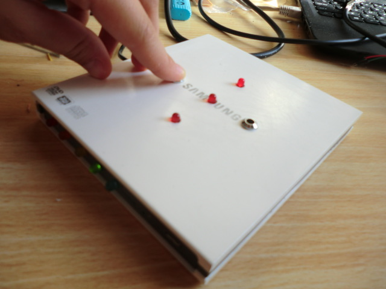
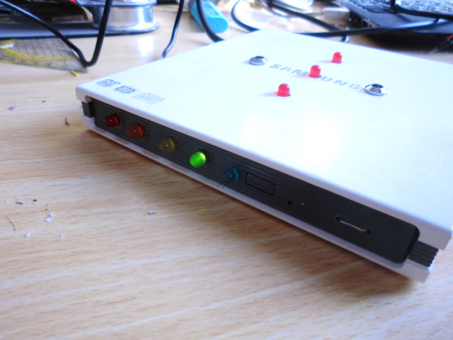
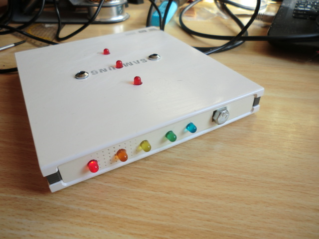
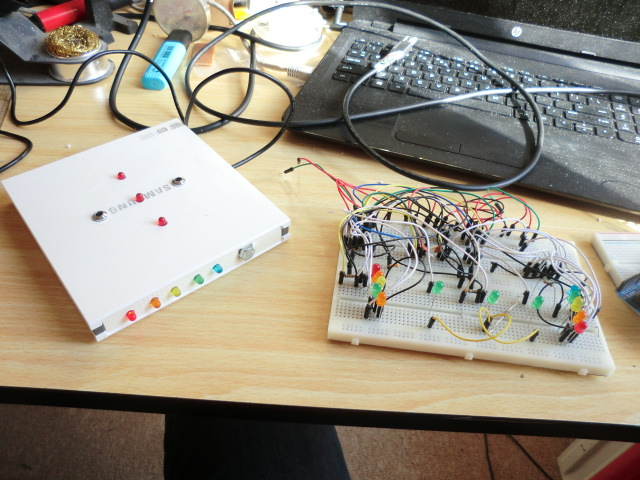
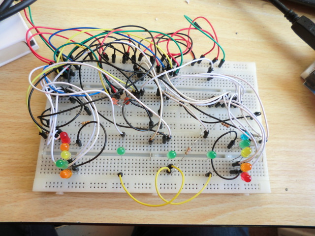
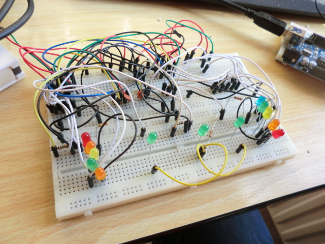
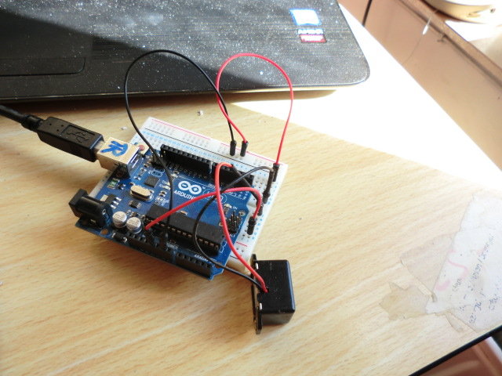

# MysteryMachine2

MysteryMachine2 schematic.

MysteryMachine2 is a more complex variant of [MysteryMachine](https://github.com/richelbilderbeek/MysteryMachine).

MysteryMachine2 is developed by (alphabetic list):

  * Nora Migdad
  * Richel Bilderbeek
  * Willy Bakker

## 2017-07-30 build

Built by Carmen IJsebaart (drilling, glueing, soldering) and Richel Bilderbeek (coordinating, drilling, glueing, soldering, testing).

